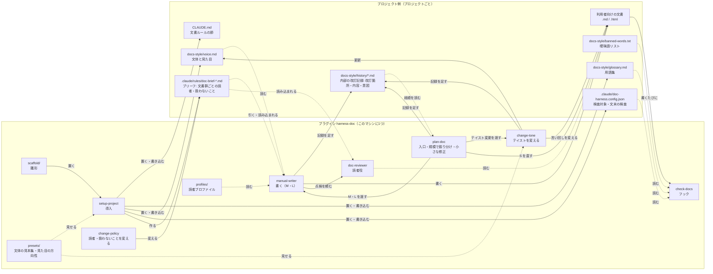

# 全体構成図 — 何がどこにあるか

| 項目 | 内容 |
|---|---|
| 対応ハーネス版 | harness-doc 0.8.0 |

プラグインとプロジェクト側のファイルが、どこにあり、何が何を読むかを示す図。

**ポイント**:

- **2層に分かれる。** プラグイン（このマシンに1つ）と、プロジェクト側のファイル（プロジェクトごと）
- **プロジェクトごとに違うものは、すべてプロジェクト側にある。** 用語集・曖昧語リスト・文体（`voice.md`）・文書群ごとの読者と扱わないこと（ブリーフ）・検査対象の設定
- **プロジェクト側のファイルは `setup-project` が置き、利用者が育てる。** プラグインを更新しても上書きされない

## 図の構成

| 要素 | 役割 |
|---|---|
| スキル | `setup-project`（導入）・`plan-doc`（入口。規模で振り分け、小さな修正はこの中で終える）・`manual-writer`（書く。規模 M・L）・`change-tone`（テイストを変える）・`change-policy`（読者や扱わないことを変える） |
| エージェント | `doc-reviewer`（読者役。指摘だけ返し、書き換えない） |
| フック | `check-docs`（書いた直後に機械で検査する） |
| 同梱の資料 | 雛形（`scaffold/`）・文体の見本集・見た目の方向性・読者プロファイル |
| スキルが使うスクリプト | `scripts/brief.mjs`（ブリーフを引く。書き込みは `setup-project` の `apply.mjs --brief`）・`scripts/history.mjs`（内部の改訂記録を読み書きする）・`scripts/complete-doc.mjs`（完了処理の検査） |
| プロジェクト側 | `CLAUDE.md` の節・`docs-style/`・`.claude/doc-harness.config.json`・`.claude/rules/doc-brief-*.md`（ブリーフ） |

## 図

## 読み方

- **実線**は書き込み・呼び出し、**点線**は読むだけ
- フックは `CONFIG`・`GLOSSARY`・`BANNED` を**書き込みのたびに読み直す**。決まりを変えると、次の書き込みから効く（再起動は要らない）
- `CONFIG` が無いプロジェクトでは、フックは何もしない。プラグインを全プロジェクトに入れても、導入していないプロジェクトの作業は止まらない

## 2層の違い

| | プラグイン | プロジェクト側 |
|---|---|---|
| 数 | このマシンに1つ | プロジェクトごと |
| 置く方法 | `claude plugin install` | `setup-project` |
| 更新 | プラグインの更新で全プロジェクトに届く | 利用者が育てる。プラグインの更新では変わらない |
| git | ハーネスのリポジトリ | プロジェクトのリポジトリ |
