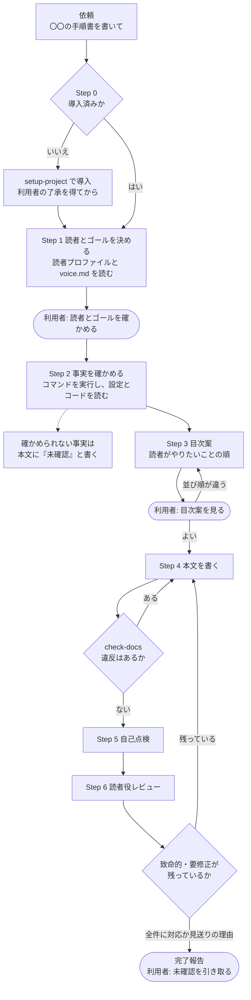

# 文書作成フロー図 — どこで止まり、どこへ戻るか

| 項目 | 内容 |
|---|---|
| 対応ハーネス版 | harness-doc 0.4.0 |

`manual-writer` が1本の文書を書く流れを、**利用者が判断する場所**と**戻り経路**に絞って示す図。

**ポイント**:

- **利用者が判断するのは3か所だけ。** 読者とゴールの確認、目次案、完了報告
- **機械の検査と読者役の点検は、Claude の判断を通さずに差し戻す。** 書くたびにフック、書き終えたら読者役
- **前に進むだけではない。** 読者役の致命的な指摘は本文へ、事実が確かめられなければ「未確認」として残る

## 図の構成

| アクター | 役割 |
|---|---|
| 利用者 | 読者とゴール・目次案を確かめ、完了報告の「未確認」を引き取る |
| メイン Claude | `manual-writer` の手順を進め、書く |
| フック | 書くたびに `check-docs` で検査し、違反を差し戻す |
| 読者役 | `doc-reviewer`。文書だけを読んで指摘を返す。書き換えない |

## 図

## 読み方

- **丸い箱が利用者の判断。** それ以外は Claude と仕組みが進める
- `HOOK` の差し戻しは**書くたびに**起きる。Claude は指摘を受けてその場で直すので、利用者は気にしなくてよい
- 読者役の指摘には全件に「対応済み」か「見送り（理由）」が付く。致命的が残っていれば `S4` に戻る

## 利用者が止める場所

| 場所 | 何を見るか | 止めたときに起きること |
|---|---|---|
| 読者とゴール | 頼んだ内容と合っているか | 読者を決め直して、事実確認からやり直す |
| 目次案 | 読者がやりたいことの順に並んでいるか | 目次を作り直す。本文を書く前なので手戻りが小さい |
| 完了報告 | 未確認の項目、見送った指摘の理由 | 未確認を確かめて伝えれば、その部分を書き直す |
