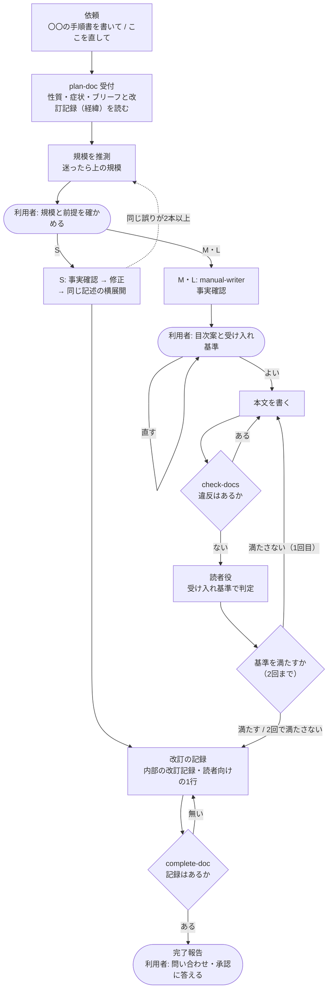

# 文書作成フロー図 — どこで止まり、どこへ戻るか

| 項目 | 内容 |
|---|---|
| 対応ハーネス版 | harness-doc 0.8.0 |

文書を書く・直す依頼が、入口の `plan-doc` から**規模ごとの経路**に分かれ、改訂の記録を残して終わるまでを、**利用者が判断する場所**と**戻り経路**に絞って示す図。

**ポイント**:

- **入口は `plan-doc` 1つ。** 依頼の性質と規模（S/M/L）を判定し、規模に合った工程だけを通す
- **小さな修正（S）は短い経路で終わる。** 目次案と読者役レビューを省き、事実確認・修正・同じ記述の横展開・改訂の記録だけを通す
- **読者役は受け入れ基準で判定し、2回で終える。** 2回で基準を満たさなければ、3回目をまわさず利用者に判断を渡す
- **改訂の記録は必ず残す。** 完了報告の前に、完了処理の検査が記録の有無を確かめる（コミットのときに止めるのは次の版）

## 図の構成

| アクター | 役割 |
|---|---|
| 利用者 | 規模と前提・目次案と受け入れ基準を確かめ、完了報告の問い合わせと承認に答える |
| メイン Claude | `plan-doc` で受け付けて振り分け、S はそのまま、M・L は `manual-writer` の手順で書く |
| フック | 書くたびに `check-docs` で検査し、違反を差し戻す |
| 読者役 | `doc-reviewer`。文書とブリーフだけを読み、受け入れ基準で判定して指摘を返す。書き手の意図（内部の改訂記録）は知らない |

## 図

## 読み方

- **丸い箱が利用者の判断。** それ以外は Claude と仕組みが進める
- `HOOK` の差し戻しは**書くたびに**起きる。Claude は指摘を受けてその場で直すので、利用者は気にしなくてよい
- 読者役の指摘には全件に「対応済み」か「見送り（理由）」が付く。書き手の意図（改訂意図）を理由に見送るときは、どの意図によるかが書かれる
- **2回で基準を満たさなかったときの判断**（基準を直す・範囲外とする・もう1回まわす）は、その場で聞かず、完了報告の問いにまとめて聞かれる
- テイスト変更は `change-tone`、読者や扱う範囲の変更は `change-policy` に渡る（図には描かない。[テイスト変更フロー図](05_テイスト変更フロー図.md)）

## 利用者が止める場所

| 場所 | 何を見るか | 止めたときに起きること |
|---|---|---|
| 規模と前提 | 依頼の大きさの見立てと、読者・扱わないこと | 規模を直して経路が変わる。読者を直すならブリーフも直る |
| 目次案と受け入れ基準（M・L） | 読者がやりたいことの順に並んでいるか。基準が読者のゴールに合っているか | 目次と基準を作り直す。本文を書く前なので手戻りが小さい |
| 完了報告 | 問い合わせ（確かめられなかった事実）、事実の変更、見送った指摘の理由 | 回答を伝えれば、その部分を書き直す |
