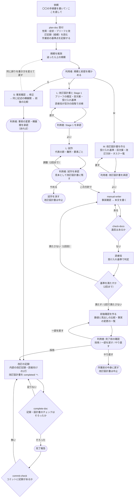

# 文書作成フロー図 — どこで止まり、どこへ戻るか

| 項目 | 内容 |
|---|---|
| 対応ハーネス版 | harness-doc 0.13.0 |

文書を書く・直す依頼が、入口の `plan-doc` から**規模ごとの経路**に分かれ、改訂の記録を残して終わるまでを、**利用者が判断する場所**と**戻り経路**に絞って示す図。

**ポイント**:

- **入口は `plan-doc` 1つ。** 依頼の性質と規模（S/M/L）を判定し、規模に合った工程だけを通す。続けての依頼（「やっぱり前の書き方に戻して」）も、毎回ここから始める
- **小さな修正（S）は短い経路で終わる。** 目次案と読者役レビューを省き、事実確認・修正・同じ記述の横展開・改訂の記録だけを通す
- **M・L は改訂設計書を作り、受け入れ基準と目次案の承認を取ってから書く。** 書いた後は、前後確認と問い合わせを1回の「完了前の確認」にまとめて聞く
- **読者役は受け入れ基準で判定し、2回で終える。** 2回で基準を満たさなければ、3回目をまわさず利用者に判断を渡す
- **改訂の記録は必ず残す。** 完了報告の前に完了処理の検査が確かめ、コミットのときにはフックが確かめる（記録が無ければ止める）

## 図の構成

| アクター | 役割 |
|---|---|
| 利用者 | 規模と前提・改訂設計書（受け入れ基準と目次案）を確かめ、完了前の確認（前後確認・問い合わせ）に答える |
| メイン Claude | `plan-doc` で受け付けて振り分け、S はそのまま、M・L は改訂設計書を作って `manual-writer` の手順で書く |
| フック | 書くたびに `check-docs` で検査し、違反を差し戻す。コミットの前に `commit-check` が改訂の記録を確かめる |
| 読者役 | `doc-reviewer`。文書とブリーフだけを読み、受け入れ基準で判定して指摘を返す。書き手の意図（内部の改訂記録・改訂設計書）は知らない（フックが読ませない） |

## 図

## 読み方

- **丸い箱が利用者の判断。** それ以外は Claude と仕組みが進める。確認の回数の上限は S が1〜2回、M が3回、L が4回
- `HOOK` の差し戻しは**書くたびに**起きる。Claude は指摘を受けてその場で直すので、利用者は気にしなくてよい
- 読者役の指摘には全件に「対応済み」か「見送り（理由）」が付く。書き手の意図（改訂意図）を理由に見送るときは、どの意図によるかが書かれる
- **2回で基準を満たさなかったときの判断**（基準を直す・範囲外とする・もう1回まわす）は、その場で聞かず、完了前の確認にまとめて聞かれる
- 完了前の確認で「やり直す」を選ぶと、文書を作業前の基準点に戻す（作業中に手で直した分も消えることを、その場で確かめる）
- 規模 L は、本文を書く前に目次の段階で読者役が点検し（本文より安い）、文章の調子は試作で合意してから全体を書く。試作のファイルは元の文書の隣に `.proto-1` の名前で置き、承認の後に消す
- テイスト変更は、plan-doc で試作の承認を取ってから `change-tone` に渡る。読者や扱う範囲の変更は `change-policy` に渡る（図には描かない。[テイスト変更フロー図](05_テイスト変更フロー図.md)）
- `COMMIT` は Claude がコミットするときに働く。記録が無ければコミットが止まり、記録を足してからやり直す（[フック検査の流れ図](04_フック検査の流れ図.md)）

## 利用者が止める場所

| 場所 | 何を見るか | 止めたときに起きること |
|---|---|---|
| 規模と前提 | 依頼の大きさの見立てと、読者・扱わないこと | 規模を直して経路が変わる。読者を直すならブリーフも直る |
| 改訂設計書（M）・Stage 1（L） | 受け入れ基準が読者のゴールに合っているか。目次が読者のやりたいことの順に並んでいるか | 設計書を作り直す。本文を書く前なので手戻りが小さい |
| 試作（L） | 承認した試作の調子と書き方で、全体を書いてよいか。読者がつまずく点に照らして何が良くなったか | 試作を作り直す（調整は2回まで。作り直しは確認の回数に入らない）。全体を書く前なので手戻りが小さい。「やめる」なら試作を消し、文書は変わらない |
| 完了前の確認（M・L）・事実の変更の承認（S） | 前後確認（数値・見出し・事実の変更の一覧）、問い合わせ（確かめられなかった事実）、見送った指摘の理由 | 一部を戻す・やり直す。回答を伝えれば、その部分を書き直す |
