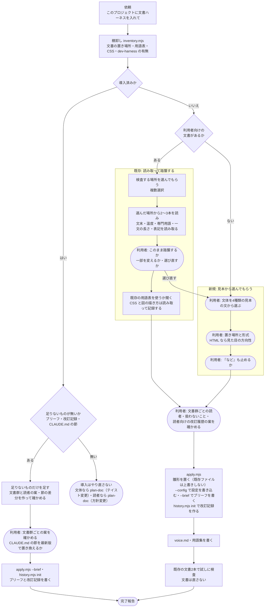

# 導入フロー図 — 新規か既存かで何が変わるか

| 項目 | 内容 |
|---|---|
| 対応ハーネス版 | harness-doc 0.8.0 |

`setup-project` が、プロジェクトの状態に応じて何を読み取り、何を利用者に聞くかを示す図。

**ポイント**:

- **最初に棚卸しをして、新規か既存かを見分ける。** 文書の置き場所・既存の用語表・CSS を調べる（読むだけ）
- **既存なら「読み取って確かめてもらう」、新規なら「見本から選んでもらう」。** 既に決まっていることは聞かない
- **既存の文書と CSS は書き換えない。** 変わる既存ファイルは `CLAUDE.md`（末尾に節を足す）だけ

## 図の構成

| アクター | 役割 |
|---|---|
| 利用者 | 選択肢から選ぶ。読み取った結果が違っていれば直す |
| setup-project | 棚卸し・読み取り・質問・書き込みを進める |
| inventory.mjs | 文書の置き場所・用語表・CSS を数える（読むだけ） |
| apply.mjs | 雛形を置き、決めた値を設定に書き込む |

## 図

## 読み方

- 丸い箱が利用者の判断。既存のプロジェクトでは、聞かれるのは「場所」「踏襲してよいか」「用語表を使うか」「文書群ごとの読者と扱わないこと」の4つ程度
- **文書群ごとの読者と扱わないことは、ここで一度決めればブリーフに残る。** 文書を書くたびに聞き直さない（`plan-doc`・`manual-writer` は欠けた項目だけを聞く）
- 導入済みのプロジェクトでは、導入はやり直さず、足りないもの（ブリーフ・内部の改訂記録・CLAUDE.md の節の最新版）だけを足す
- `TRY` で指摘が多い場合、原因が文書なのか決まりなのかを示し、**決まりの側が合っていなければその場で直すかを聞く**

## dev-harness 併用時に自動で起きること

| 起きること | 理由 |
|---|---|
| `docs/設計書/`・`docs/features/`・`docs/reviews/`・`docs/handoff/` を検査対象から外す | harness-core が書く開発者向けの記録で、検査すると `update-docs` のたびに止まる |
| これらの場所を、検査する場所の候補に出さない | 同上 |
| `.claude/rules/` の用語表を見つけたら、検査に使うかを聞く | 用語表を2つに割らない |
