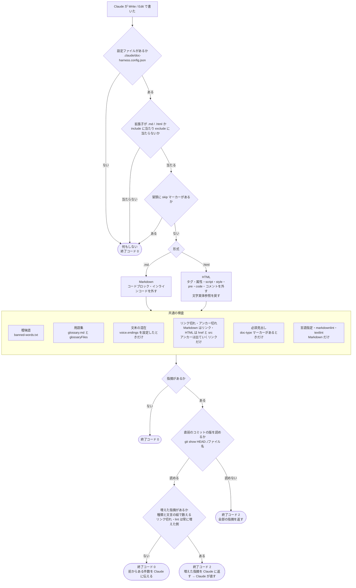
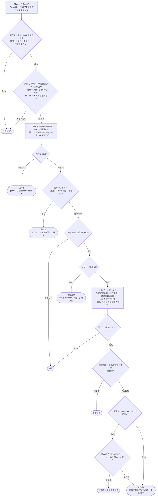

# フック検査の流れ図 — 何を読み、何を見るか

| 項目 | 内容 |
|---|---|
| 対応ハーネス版 | harness-doc 0.12.0 |

harness-doc のフックが何を読み、何を見るかを示す図。`check-docs`（書き込みのたび）・`commit-check`（コミットの前）・`reviewer-guard`（読者役が読むとき）の3つがある。

## 書き込みのたびの検査（check-docs）

`check-docs` フックが、1回の書き込みで対象を判定し、検査し、結果を返すまでの流れ。

**ポイント**:

- **素通りの条件が先に並ぶ。** 設定が無い・対象外のファイル・抑止マーカーがある、のどれかなら何もしない
- **Markdown と HTML で、本文の取り出し方だけが違う。** 取り出した後の検査（曖昧語・用語集・文末・リンク・見出し）は共通
- **違反は Claude に返る。** 終了コード 2 で、指摘が Claude に渡り、Claude が直す
- **止めるのは、直前のコミットより増えた指摘だけ**（0.12.0）。前からある指摘は件数だけを伝える。リンク切れと lint は比べずに毎回止める

### 図

### 読み方

- 行に `<!-- check-docs: ignore 理由 -->` があれば、その行の曖昧語・用語集・リンク切れは見ない
- 設定ファイル・用語集・曖昧語リストは**書き込みのたびに読み直す**。決まりを変えると次の書き込みから効く
- 書き込みそのものは止められない（ツールが実行された後に走るため）。差し戻して直させる方式である

検査項目の細かい規則は [check-docs 仕様](../reference/check-docs仕様.md) にある。

## コミット時の検査（0.10.0）

`commit-check` フックが、Claude の `git commit` の前に、文書の改訂の記録があるかを確かめる流れ。
スキルを通らなかった作業（続けての依頼で `plan-doc` を使わなかったとき）も、ここで止まる。

- 判定は `scripts/complete-doc.mjs` の `--staged` と同じ。`--amend` は1つ前の版と比べる
- **問い合わせの印（`<!-- 問い合わせ: -->`）は、コミット時は警告だけ**。印は改訂設計書の「問い合わせ」で管理していて、依頼者の回答を待つあいだ残るのが正しい状態のため。完了報告の前の検査（`complete-doc.mjs`）では NG（`--allow-queries` で警告）
- 試作のファイル（`<名前>.proto-1.<拡張子>`）がコミットに入っていたら、文書の記録の有無にかかわらず止める
- 検査が20秒で終わらなければ止め、文書を分けてコミットするよう返す
- 止めたときの表示の1行目は、理由によらず「❌ 改訂の記録が無い文書を含むコミット」。理由は2行目から後に書く
- 人が手でしたコミットは止まらない（Claude のコマンドだけを見るフック）
- `doc-record: skip（改訂の記録なしでコミットする: <理由>）` は、harness-doc の工程を通さない正当な変更のための印。止める代わりに依頼者の承認を求める（`ask`）。承認の画面にはフックの理由が出ず、コマンドの本文だけが出るので、何を承認するのかが本文から読めるよう、理由の書き方を決めている。この形でない `doc-record: skip` は止める
- 対話の許可を省くモード（bypassPermissions）でも、`ask` は承認の画面を出す（実地検証で確かめた）。非対話で承認を求められないときは、コミットは止まる
- config の `completeCheck` が `"warn"` なら、止める代わりに警告だけを出す。`"off"` なら何もしない
- 「作業中」のまま7日を超えた改訂設計書があれば、警告に出す
- git の別名（alias）・`git revert`・`cherry-pick`・`merge` で作るコミットは見ていない

## 読者役の読む範囲（0.10.0）

`reviewer-guard` フックは、読者役（`doc-reviewer`）が内部の改訂記録（`docs-style/history/`）と改訂設計書（`docs-style/plans/`）を読むのを止める。
`Read` はその中のファイルを、`Grep` はそれを含む範囲（プロジェクトのルートのような、記録を含むフォルダー）の検索を止める。メインのエージェントとほかのエージェントは止めない。
