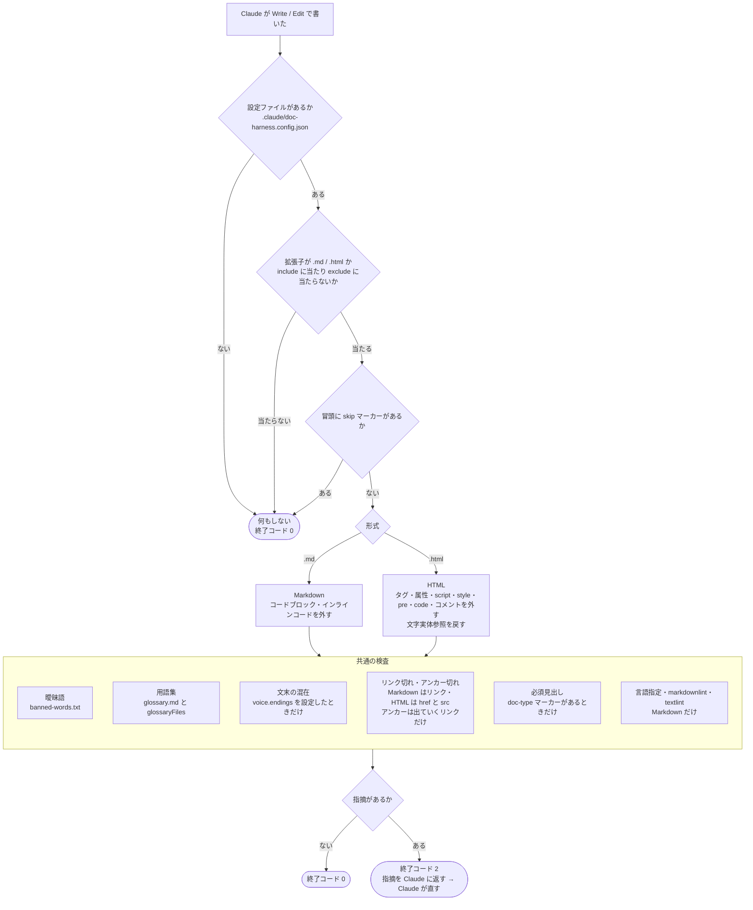

# フック検査の流れ図 — 何を読み、何を見るか

| 項目 | 内容 |
|---|---|
| 対応ハーネス版 | harness-doc 0.6.0 |

`check-docs` フックが、1回の書き込みで対象を判定し、検査し、結果を返すまでの流れを示す図。

**ポイント**:

- **素通りの条件が先に並ぶ。** 設定が無い・対象外のファイル・抑止マーカーがある、のどれかなら何もしない
- **Markdown と HTML で、本文の取り出し方だけが違う。** 取り出した後の検査（曖昧語・用語集・文末・リンク・見出し）は共通
- **違反は Claude に返る。** 終了コード 2 で、指摘が Claude に渡り、Claude が直す

## 図

## 読み方

- 行に `<!-- check-docs: ignore 理由 -->` があれば、その行の曖昧語・用語集・リンク切れは見ない
- 設定ファイル・用語集・曖昧語リストは**書き込みのたびに読み直す**。決まりを変えると次の書き込みから効く
- 書き込みそのものは止められない（ツールが実行された後に走るため）。差し戻して直させる方式である

検査項目の細かい規則は [check-docs 仕様](../reference/check-docs仕様.md) にある。
