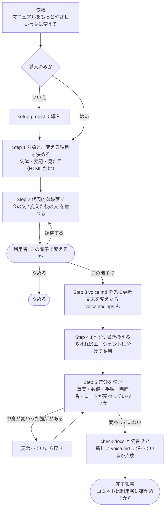

# テイスト変更フロー図 — 何を変え、何を変えないか

| 項目 | 内容 |
|---|---|
| 対応ハーネス版 | harness-doc 0.4.0 |

`change-tone` が既存の文書のテイストを変える流れを、**合意の場所**と**中身を守る確認**に絞って示す図。

**ポイント**:

- **見本で合意するまで書き換えない。** 今の文と変えた後の文を並べて見せる
- **決まり（`voice.md`）を先に書き、文書は後で書き換える。** 途中で止まっても、何に揃えるかが残る
- **最後に差分で、中身が変わっていないかを確かめる。** 文章の変更は、壊れても機械の検査では見つからない

## 図

## 変えてよいもの・変えないもの

| 変えてよい | 変えない |
|---|---|
| 文末・語尾・言い回し・語りかけ | 書いてある事実・数値 |
| 長い文を2つに分ける | 手順の順番と数 |
| 専門用語の言い換え（用語集にあるものは用語集に従う） | 画面名・ボタン名・コマンド・コード・ファイル名 |
| 表記（長音・数字） | 見出しの構成・リンク先・画像 |
| HTML: 本文の文字、CSS の値（色・文字の大きさ・余白） | HTML: タグの構造・クラス名・属性 |

読者役が「事実を足すべき」と指摘しても、テイストの変更では足さない。中身を直したいときは `manual-writer` に回す。
