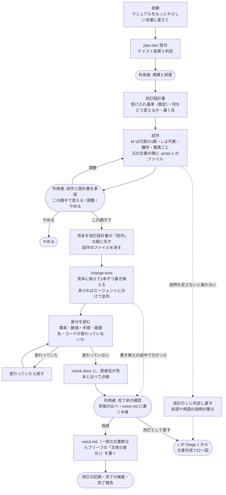

# テイスト変更フロー図 — 何を変え、何を変えないか

| 項目 | 内容 |
|---|---|
| 対応ハーネス版 | harness-doc 0.11.0 |

文書のテイスト（文体・表記・見た目）を変える依頼が、`plan-doc` の試作で合意してから `change-tone` で書き換えられるまでを、**合意の場所**と**中身を守る確認**に絞って示す図。

**ポイント**:

- **入口は `plan-doc`。** 「もっとやさしい言葉にして」もテイスト変更として受け付け、1本なら規模 M、2本以上なら L にする
- **試作で合意するまで書き換えない。** 今の文と変えた後の文を並べて見せる（HTML なら試作のファイルをブラウザーで並べて開ける）
- **決まり（`voice.md`）は、完了前の確認で採用が決まってから書く。** 先に書くと、「やり直す」になったときに決まりだけが変わったまま残る。何に揃えるかは、改訂設計書の「試作」の節に残る
- **最後に差分で、中身が変わっていないかを確かめる。** 文章の変更は、壊れても機械の検査では見つからない

## 図

## 読み方

- **丸い箱が利用者の判断。** 確認は規模と前提・試作・完了前の確認の3回が基本
- 試作は**元の文書の隣に** `<名前>.proto-1.<拡張子>` で置く。HTML の CSS・画像・隣のページへの相対パスがそのまま効く。名前に `.proto-` が入ったファイルは検査の対象にならず、残っていると完了処理の検査が止める
- **2案を出すのは、方針が決まっていないとき（「もっとやさしく」）だけ**
- 見た目を変えるときは、CSS の値の変更前→変更後の表を試作と同じ問いで示す。コントラスト比 4.5:1 を下回る変更は止める
- 一部の文書群だけ変えるときは、`voice.md` ではなく、その文書群のブリーフの「文体の差分」に書く。文末を変えて文書群ごとに文末が違うことになったら、文末の機械の検査（`voice.endings`）を止める
- **文末を変えるときは、書き換えの前に文末の機械の検査を止める**（`voice.endings` を `null` に）。止めないと、書き換えのたびに検査が新しい文末を止める。採用が決まったら新しい値を書き、やめたら元に戻す
- 確認は M で3回、L で4回まで（L は試作の調整に1回の余りがある）

## 変えてよいもの・変えないもの

| 変えてよい | 変えない |
|---|---|
| 文末・語尾、言い回し、語りかけ、文の区切り | 事実・数値・手順の順番と数 |
| 専門用語の言い換え（用語集に従う） | 画面名・ボタン名・コマンド・コード・ファイル名 |
| 表記（長音・数字） | 見出しの構成・リンク先・画像 |
| HTML: 本文のテキスト・CSS の値 | HTML: タグの構造・クラス名・属性 |
